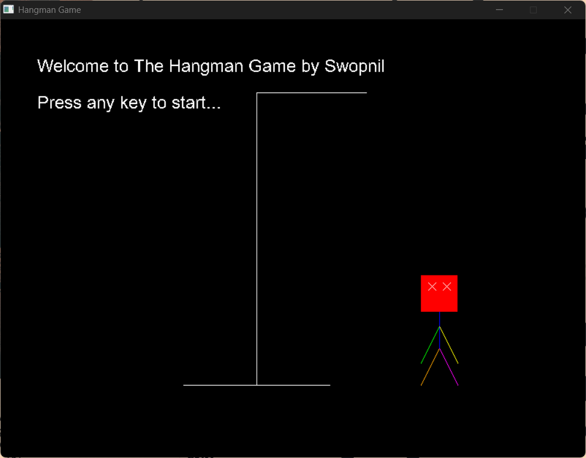

# Hangman-In-C

Welcome to **The-Hangman**, a visually appealing and interactive Hangman game built by me for my C class project using SDL2 and SDL2_ttf libraries. This project showcases a classic word-guessing game with enhanced graphics and animations to provide an engaging user experience.

## Features

- **Colorful and Animated Hangman Figure**: The Hangman figure is drawn with vibrant colors and simple animations.
- **Case-Insensitive Word Guessing**: The game handles both uppercase and lowercase letters seamlessly.
- **User-Friendly Interface**: Clear and intuitive interface with prompts and messages.
- **Customizable Background**: Option to add a background image for a more immersive experience.
- **Welcome Screen**: Includes a welcome screen with a larger Hangman figure and game title.

## Screenshots


*Welcome screen*


*Game screen*

## Getting Started

### Prerequisites

- **SDL2**: Simple DirectMedia Layer library.
- **SDL2_ttf**: TrueType font rendering library for SDL2.

### Installation

1. **Clone the repository**:
    ```sh
    git clone https://github.com/swopnil7/Hangman-SDL-C.git
    cd Hangman-SDL-C
    ```

2. **Ensure the SDL2 and SDL2_ttf libraries are in the correct directories**:
    - The [SDL2](http://_vscodecontentref_/1) directory should contain the SDL2 and SDL2_ttf header files.
    - The [lib](http://_vscodecontentref_/2) directory should contain the SDL2 and SDL2_ttf library files (`libSDL2.a`, `libSDL2.dll`, `libSDL2_ttf.a`, `libSDL2_ttf.dll`, etc.).

3. **Compile the project using `gcc`**:
    ```sh
    gcc -o hangman src/main.c src/game.c src/renderer.c -I./src/include/SDL2 -L./src/lib -lmingw32 -lSDL2main -lSDL2 -lSDL2_ttf
    ```

4. **Run the compiled program**:
    ```sh
    ./hangman
    ```

## Usage

- **Welcome Screen**: Press any key to start the game.
- **Enter Word**: Type the word to be guessed (letters will be hidden).
- **Guess Letters**: Use the keyboard to guess letters. The game will indicate correct and incorrect guesses.
- **Win/Lose**: The game will display a "You won!" or "You lost!" message based on the outcome.

## Contributing

Contributions are welcome! Please fork the repository and submit a pull request for any improvements or bug fixes.

## License

This project is licensed under the MIT License. See the [LICENSE file](LICENSE.md) for details.

## Acknowledgements

- **SDL2**: [Simple DirectMedia Layer](https://www.libsdl.org/)
- **SDL2_ttf**: [SDL_ttf Library](https://www.libsdl.org/projects/SDL_ttf/)

## Contact

For any questions or suggestions, feel free to reach out to [me](mailto:report2swopnil@gmail.com).

Enjoy playing Hangman-SDL-C!